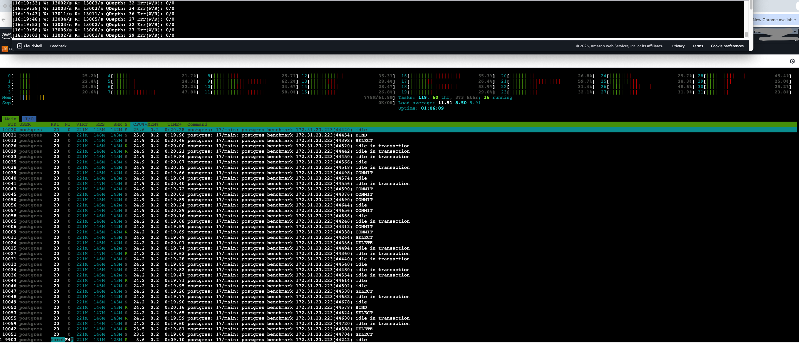

```bash
./pg_queue_bench   --host=$HOST   --port=5432   --db=benchmark
   --user=postgres   --password=postgres   --writers=40   --readers=40   --duration=120s   --payload=1024   --report=5s --throttle_writes 
13000
```



# Run 1
```bash
[16:23:07] W: 15601/s R: 15303/s QDepth: 1491 Err(W/R): 0/0
[16:23:12] W: 13006/s R: 13298/s QDepth: 31 Err(W/R): 0/0
[16:23:17] W: 13005/s R: 13006/s QDepth: 27 Err(W/R): 0/0
[16:23:22] W: 13004/s R: 13003/s QDepth: 36 Err(W/R): 0/0
[16:23:27] W: 13008/s R: 13008/s QDepth: 33 Err(W/R): 0/0
[16:23:32] W: 13003/s R: 13004/s QDepth: 31 Err(W/R): 0/0
[16:23:37] W: 13001/s R: 13000/s QDepth: 38 Err(W/R): 0/0
[16:23:42] W: 13002/s R: 13003/s QDepth: 31 Err(W/R): 0/0
[16:23:47] W: 13002/s R: 13002/s QDepth: 32 Err(W/R): 0/0
[16:23:52] W: 13002/s R: 13002/s QDepth: 32 Err(W/R): 0/0
[16:23:57] W: 13002/s R: 13002/s QDepth: 34 Err(W/R): 0/0
^[[A^C
ubuntu@ip-172-31-23-223:/tmp/postgres-queue-benchmarks$ ^C
ubuntu@ip-172-31-23-223:/tmp/postgres-queue-benchmarks$ ^C
ubuntu@ip-172-31-23-223:/tmp/postgres-queue-benchmarks$ ^C
ubuntu@ip-172-31-23-223:/tmp/postgres-queue-benchmarks$ ^C
ubuntu@ip-172-31-23-223:/tmp/postgres-queue-benchmarks$ for i in {1..3}; do ./pg_queue_bench   --host=$HOST   --port=5432   --db=benchmark   --user=postgres   --password=postgres   --writers=50   --readers=50   --duration=120s   --payload=1024   --report=5s --throttle_writes
13000; [ $i -lt 3 ] && sleep 120; done
[16:24:14] W: 15605/s R: 15598/s QDepth: 36 Err(W/R): 0/0
[16:24:19] W: 13005/s R: 13006/s QDepth: 30 Err(W/R): 0/0
[16:24:24] W: 13002/s R: 13002/s QDepth: 28 Err(W/R): 0/0
[16:24:29] W: 13004/s R: 13004/s QDepth: 29 Err(W/R): 0/0
[16:24:34] W: 13003/s R: 13002/s QDepth: 31 Err(W/R): 0/0
[16:24:39] W: 13000/s R: 13000/s QDepth: 30 Err(W/R): 0/0
[16:24:44] W: 13004/s R: 13005/s QDepth: 28 Err(W/R): 0/0
[16:24:49] W: 13002/s R: 13001/s QDepth: 33 Err(W/R): 0/0
[16:24:54] W: 13002/s R: 13002/s QDepth: 30 Err(W/R): 0/0
[16:24:59] W: 13002/s R: 13002/s QDepth: 29 Err(W/R): 0/0
[16:25:04] W: 13001/s R: 13002/s QDepth: 26 Err(W/R): 0/0
[16:25:09] W: 13005/s R: 13003/s QDepth: 35 Err(W/R): 0/0
[16:25:14] W: 13006/s R: 13007/s QDepth: 29 Err(W/R): 0/0
[16:25:19] W: 13003/s R: 11335/s QDepth: 8369 Err(W/R): 0/0
[16:25:24] W: 13007/s R: 14401/s QDepth: 1399 Err(W/R): 0/0
[16:25:29] W: 13003/s R: 13276/s QDepth: 32 Err(W/R): 0/0
[16:25:34] W: 13002/s R: 13003/s QDepth: 26 Err(W/R): 0/0
[16:25:39] W: 13002/s R: 13001/s QDepth: 33 Err(W/R): 0/0
[16:25:44] W: 13005/s R: 13007/s QDepth: 26 Err(W/R): 0/0
[16:25:49] W: 13001/s R: 13001/s QDepth: 27 Err(W/R): 0/0
[16:25:54] W: 13001/s R: 13001/s QDepth: 30 Err(W/R): 0/0
[16:25:59] W: 13002/s R: 13002/s QDepth: 30 Err(W/R): 0/0
[16:26:04] W: 13001/s R: 13001/s QDepth: 29 Err(W/R): 0/0

=== Summary ===
Total Writes: 1559607
Total Reads: 1559586
Total Updates: 1559586
Write Errors: 0
Read Errors: 11
Avg Write Throughput: 12996.73 rows/sec
Avg Read Throughput: 12996.55 rows/sec

Write Latencies (INSERT only):
P50: 777.215µs
P95: 1.219583ms
P99: 1.858559ms

Read Latencies (txn: SELECT+DELETE+INSERT):
P50: 2.711551ms
P95: 3.735551ms
P99: 5.206015ms

End-to-End Latencies (created_at → consumed):
P50: 3.106815ms
P95: 460.324863ms
P99: 1.158676479s

2025/09/30 16:26:08 benchmark complete
```

# Run 2
```bash
[16:28:13] W: 15611/s R: 15604/s QDepth: 35 Err(W/R): 0/0
[16:28:18] W: 13008/s R: 13008/s QDepth: 34 Err(W/R): 0/0
[16:28:23] W: 13000/s R: 13001/s QDepth: 27 Err(W/R): 0/0
[16:28:28] W: 13002/s R: 13002/s QDepth: 28 Err(W/R): 0/0
[16:28:33] W: 13002/s R: 13002/s QDepth: 29 Err(W/R): 0/0
[16:28:38] W: 13002/s R: 13002/s QDepth: 30 Err(W/R): 0/0
[16:28:43] W: 13002/s R: 13001/s QDepth: 36 Err(W/R): 0/0
[16:28:48] W: 13003/s R: 13004/s QDepth: 33 Err(W/R): 0/0
[16:28:53] W: 13000/s R: 13000/s QDepth: 34 Err(W/R): 0/0
[16:28:58] W: 13002/s R: 13003/s QDepth: 32 Err(W/R): 0/0
[16:29:03] W: 13002/s R: 13002/s QDepth: 30 Err(W/R): 0/0
[16:29:08] W: 13002/s R: 13003/s QDepth: 28 Err(W/R): 0/0
[16:29:13] W: 13002/s R: 13001/s QDepth: 34 Err(W/R): 0/0
[16:29:18] W: 13001/s R: 13002/s QDepth: 27 Err(W/R): 0/0
[16:29:23] W: 13004/s R: 11076/s QDepth: 9667 Err(W/R): 0/0
[16:29:28] W: 13001/s R: 14927/s QDepth: 34 Err(W/R): 0/0
[16:29:33] W: 13003/s R: 13004/s QDepth: 27 Err(W/R): 0/0
[16:29:38] W: 13001/s R: 13000/s QDepth: 30 Err(W/R): 0/0
[16:29:43] W: 13002/s R: 13001/s QDepth: 34 Err(W/R): 0/0
[16:29:48] W: 13001/s R: 12999/s QDepth: 40 Err(W/R): 0/0
[16:29:53] W: 13004/s R: 13006/s QDepth: 30 Err(W/R): 0/0
[16:29:58] W: 13004/s R: 13004/s QDepth: 31 Err(W/R): 0/0
[16:30:03] W: 13002/s R: 13003/s QDepth: 27 Err(W/R): 0/0

=== Summary ===
Total Writes: 1572263
Total Reads: 1572237
Total Updates: 1572237
Write Errors: 0
Read Errors: 10
Avg Write Throughput: 13102.19 rows/sec
Avg Read Throughput: 13101.98 rows/sec

Write Latencies (INSERT only):
P50: 778.239µs
P95: 1.214463ms
P99: 1.855487ms

Read Latencies (txn: SELECT+DELETE+INSERT):
P50: 2.717695ms
P95: 3.729407ms
P99: 5.148671ms

End-to-End Latencies (created_at → consumed):
P50: 3.108863ms
P95: 458.227711ms
P99: 1.118830591s

2025/09/30 16:30:08 benchmark complete
```

# Run 3
```bash
[16:32:13] W: 15584/s R: 15578/s QDepth: 29 Err(W/R): 0/0
[16:32:18] W: 13003/s R: 13003/s QDepth: 33 Err(W/R): 0/0
[16:32:23] W: 13002/s R: 13003/s QDepth: 27 Err(W/R): 0/0
[16:32:28] W: 13001/s R: 13001/s QDepth: 25 Err(W/R): 0/0
[16:32:33] W: 13002/s R: 13000/s QDepth: 35 Err(W/R): 0/0
[16:32:38] W: 13002/s R: 13002/s QDepth: 36 Err(W/R): 0/0
[16:32:43] W: 13005/s R: 13006/s QDepth: 31 Err(W/R): 0/0
[16:32:48] W: 13003/s R: 13003/s QDepth: 27 Err(W/R): 0/0
[16:32:53] W: 13001/s R: 13000/s QDepth: 29 Err(W/R): 0/0
[16:32:58] W: 13002/s R: 13002/s QDepth: 30 Err(W/R): 0/0
[16:33:03] W: 13004/s R: 13004/s QDepth: 32 Err(W/R): 0/0
[16:33:08] W: 13002/s R: 13003/s QDepth: 29 Err(W/R): 0/0
[16:33:13] W: 13000/s R: 13002/s QDepth: 23 Err(W/R): 0/0
[16:33:18] W: 13003/s R: 12950/s QDepth: 287 Err(W/R): 0/0
[16:33:23] W: 13004/s R: 11655/s QDepth: 7034 Err(W/R): 0/0
[16:33:28] W: 13003/s R: 14404/s QDepth: 31 Err(W/R): 0/0
[16:33:33] W: 13002/s R: 13002/s QDepth: 29 Err(W/R): 0/0
[16:33:38] W: 13002/s R: 13001/s QDepth: 36 Err(W/R): 0/0
[16:33:43] W: 13004/s R: 13003/s QDepth: 37 Err(W/R): 0/0
[16:33:48] W: 13010/s R: 13006/s QDepth: 56 Err(W/R): 0/0
[16:33:53] W: 13009/s R: 13015/s QDepth: 29 Err(W/R): 0/0
[16:33:58] W: 13001/s R: 13001/s QDepth: 29 Err(W/R): 0/0
[16:34:03] W: 13004/s R: 13003/s QDepth: 33 Err(W/R): 0/0

=== Summary ===
Total Writes: 1572253
Total Reads: 1572219
Total Updates: 1572219
Write Errors: 0
Read Errors: 17
Avg Write Throughput: 13102.11 rows/sec
Avg Read Throughput: 13101.83 rows/sec

Write Latencies (INSERT only):
P50: 769.535µs
P95: 1.206271ms
P99: 1.853439ms

Read Latencies (txn: SELECT+DELETE+INSERT):
P50: 2.705407ms
P95: 3.710975ms
P99: 5.128191ms

End-to-End Latencies (created_at → consumed):
P50: 3.078143ms
P95: 438.829055ms
P99: 1.130364927s

2025/09/30 16:34:08 benchmark complete
```