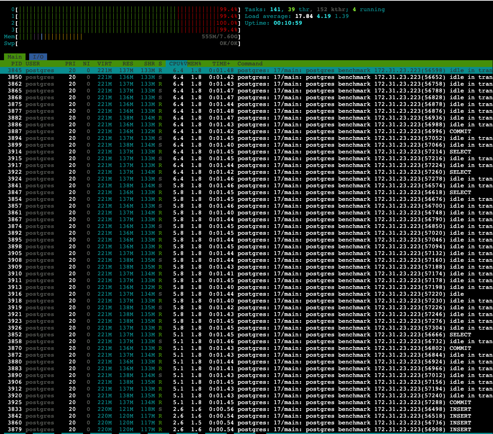

- c7i.xlarge
- io2 40GB with 10,000 IOPS
- Ubuntu 24.04
- 50 writers
- 50 readers
- 1 KB payload
- 120s duration
- absolute default postgres settings

# Run 1 (unlimited writes)

- ✍️ write: **10 MB/s**
- 📖️ read: **2.2 MB/s**
- bottleneck: 100% CPU

See  for more details.


```bash
ubuntu@ip-172-31-20-198:/tmp/postgres-queue-benchmarks$ ./pg_queue_bench \
  --host=localhost \
  --port=5432 \
  --db=benchmark \
  --user=postgres \
  --password=postgres \
  --writers=50 \
  --readers=50 \
  --duration=120s \
  --payload=1024 \
  --report=5s
[11:47:10] W: 10660/s R: 3288/s QDepth: 36860 Err(W/R): 0/0
[11:47:15] W: 10556/s R: 2784/s QDepth: 75719 Err(W/R): 0/0
[11:47:20] W: 10450/s R: 2799/s QDepth: 113976 Err(W/R): 0/0
[11:47:25] W: 11290/s R: 2766/s QDepth: 156596 Err(W/R): 0/0
[11:47:30] W: 10851/s R: 2791/s QDepth: 196894 Err(W/R): 0/0
[11:47:35] W: 10308/s R: 2605/s QDepth: 235411 Err(W/R): 0/0
[11:47:40] W: 10413/s R: 2638/s QDepth: 274285 Err(W/R): 0/0
[11:47:45] W: 10192/s R: 2586/s QDepth: 312315 Err(W/R): 0/0
[11:47:50] W: 7864/s R: 1095/s QDepth: 346159 Err(W/R): 0/0
[11:47:55] W: 6726/s R: 790/s QDepth: 375840 Err(W/R): 0/0
[11:48:00] W: 6872/s R: 636/s QDepth: 407023 Err(W/R): 0/0
[11:48:05] W: 10644/s R: 2336/s QDepth: 448556 Err(W/R): 0/0
[11:48:10] W: 10417/s R: 2598/s QDepth: 487653 Err(W/R): 0/0
[11:48:15] W: 10590/s R: 2569/s QDepth: 527758 Err(W/R): 0/0
[11:48:20] W: 10812/s R: 2536/s QDepth: 569135 Err(W/R): 0/0
[11:48:25] W: 10389/s R: 2459/s QDepth: 608786 Err(W/R): 0/0
[11:48:30] W: 10414/s R: 2333/s QDepth: 649194 Err(W/R): 0/0
[11:48:35] W: 10239/s R: 2298/s QDepth: 688901 Err(W/R): 0/0
[11:48:40] W: 10120/s R: 2231/s QDepth: 728344 Err(W/R): 0/0
[11:48:45] W: 10663/s R: 2165/s QDepth: 770832 Err(W/R): 0/0
[11:48:50] W: 9885/s R: 2065/s QDepth: 809932 Err(W/R): 0/0
[11:48:55] W: 9821/s R: 2031/s QDepth: 848880 Err(W/R): 0/0
[11:49:00] W: 10025/s R: 1985/s QDepth: 889082 Err(W/R): 0/0

=== Summary ===
Total Writes: 1200112
Total Reads: 271724
Total Updates: 271724
Write Errors: 0
Read Errors: 5
Avg Write Throughput: 10000.93 rows/sec
Avg Read Throughput: 2264.37 rows/sec

Write Latencies:
  P50: 3.389439ms
  P95: 14.270463ms
  P99: 30.818303ms

Read Latencies:
  P50: 16.973823ms
  P95: 55.214079ms
  P99: 96.206847ms

2025/09/30 11:49:05 benchmark complete
```


# Run 2 (limit writes to max reads we can get)
