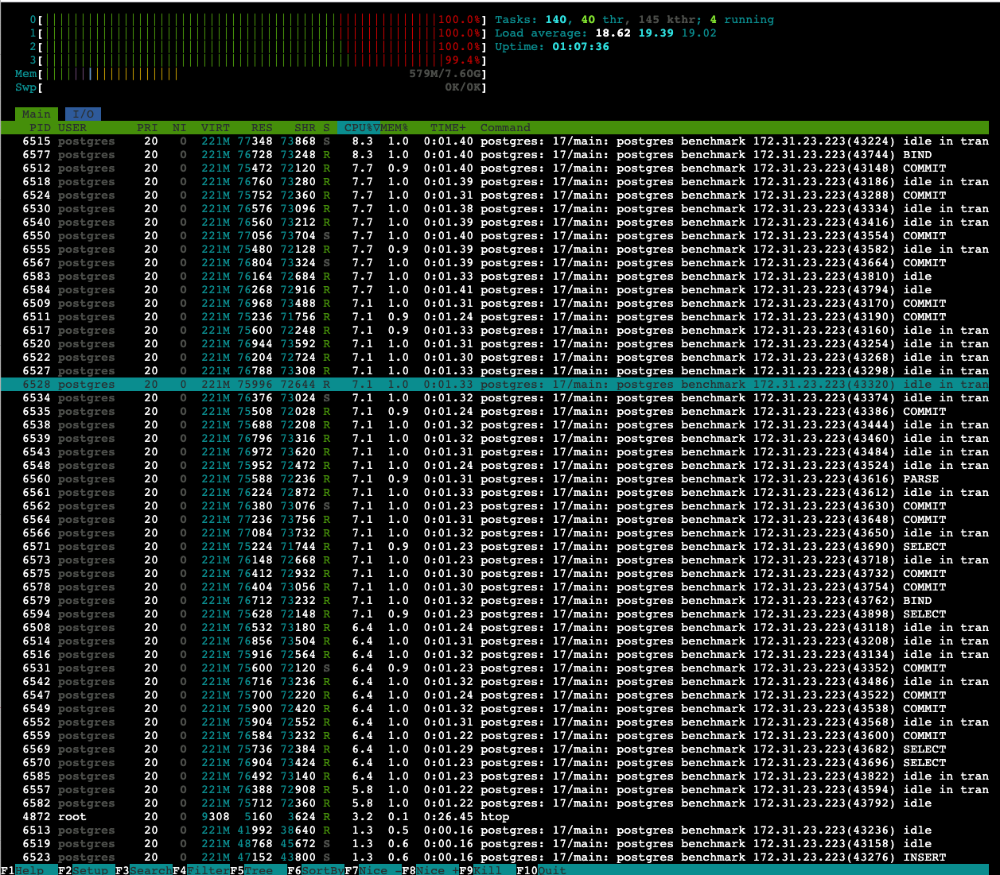

 for more details.

# Run 1
```bash
ubuntu@ip-172-31-23-223:/tmp/postgres-queue-benchmarks$ for i in {1..3}; do ./pg_queue_bench --host=$HOST --port=5432 --db=benchmark --user=postgres --password=postgres --writers=50 --readers=50 --duration=120s --payload=1024 --report=5s --throttle_writes 4200; [ $i -lt 3 ] && sleep 120; done
[13:26:24] W: 5019/s R: 5012/s QDepth: 33 Err(W/R): 0/0
[13:26:29] W: 4200/s R: 4202/s QDepth: 26 Err(W/R): 0/0
[13:26:34] W: 4201/s R: 4198/s QDepth: 41 Err(W/R): 0/0
[13:26:39] W: 4200/s R: 4201/s QDepth: 33 Err(W/R): 0/0
[13:26:44] W: 4200/s R: 4201/s QDepth: 32 Err(W/R): 0/0
[13:26:49] W: 4199/s R: 4200/s QDepth: 28 Err(W/R): 0/0
[13:26:54] W: 4201/s R: 4191/s QDepth: 77 Err(W/R): 0/0
[13:26:59] W: 4194/s R: 4205/s QDepth: 24 Err(W/R): 0/0
[13:27:04] W: 4205/s R: 4205/s QDepth: 28 Err(W/R): 0/0
[13:27:09] W: 4201/s R: 4200/s QDepth: 35 Err(W/R): 0/0
[13:27:14] W: 4200/s R: 4202/s QDepth: 27 Err(W/R): 0/0
[13:27:19] W: 4199/s R: 4200/s QDepth: 26 Err(W/R): 0/0
[13:27:24] W: 4201/s R: 4201/s QDepth: 26 Err(W/R): 0/0
[13:27:29] W: 4200/s R: 4195/s QDepth: 52 Err(W/R): 0/0
[13:27:34] W: 4198/s R: 3512/s QDepth: 3482 Err(W/R): 0/0
[13:27:39] W: 4203/s R: 4893/s QDepth: 30 Err(W/R): 0/0
[13:27:44] W: 4200/s R: 4197/s QDepth: 44 Err(W/R): 0/0
[13:27:49] W: 4200/s R: 4202/s QDepth: 34 Err(W/R): 0/0
[13:27:54] W: 4200/s R: 4200/s QDepth: 31 Err(W/R): 0/0
[13:27:59] W: 4200/s R: 4199/s QDepth: 37 Err(W/R): 0/0
[13:28:04] W: 4199/s R: 4200/s QDepth: 31 Err(W/R): 0/0
[13:28:09] W: 4197/s R: 4195/s QDepth: 44 Err(W/R): 0/0
[13:28:14] W: 4200/s R: 4201/s QDepth: 40 Err(W/R): 0/0

=== Summary ===
Total Writes: 508038
Total Reads: 508009
Total Updates: 508009
Write Errors: 0
Read Errors: 16
Avg Write Throughput: 4233.65 rows/sec
Avg Read Throughput: 4233.41 rows/sec

Write Latencies (INSERT only):
  P50: 2.205695ms
  P95: 6.635519ms
  P99: 11.034623ms

Read Latencies (txn: SELECT+DELETE+INSERT):
  P50: 8.355839ms
  P95: 12.197887ms
  P99: 18.202623ms

End-to-End Latencies (created_at → consumed):
  P50: 9.871359ms
  P95: 351.797247ms
  P99: 901.251071ms

2025/09/30 13:28:19 benchmark complete
```

# Run 2
```bash
[13:30:24] W: 5032/s R: 5024/s QDepth: 37 Err(W/R): 0/0
[13:30:29] W: 4201/s R: 4203/s QDepth: 26 Err(W/R): 0/0
[13:30:34] W: 4200/s R: 4198/s QDepth: 39 Err(W/R): 0/0
[13:30:39] W: 4200/s R: 4201/s QDepth: 32 Err(W/R): 0/0
[13:30:44] W: 4200/s R: 4200/s QDepth: 31 Err(W/R): 0/0
[13:30:49] W: 4201/s R: 4201/s QDepth: 28 Err(W/R): 0/0
[13:30:54] W: 4200/s R: 4200/s QDepth: 32 Err(W/R): 0/0
[13:30:59] W: 4199/s R: 4201/s QDepth: 25 Err(W/R): 0/0
[13:31:04] W: 4200/s R: 4200/s QDepth: 28 Err(W/R): 0/0
[13:31:09] W: 4199/s R: 4199/s QDepth: 29 Err(W/R): 0/0
[13:31:14] W: 4201/s R: 4199/s QDepth: 43 Err(W/R): 0/0
[13:31:19] W: 4199/s R: 4201/s QDepth: 32 Err(W/R): 0/0
[13:31:24] W: 4200/s R: 4202/s QDepth: 22 Err(W/R): 0/0
[13:31:29] W: 4200/s R: 4200/s QDepth: 24 Err(W/R): 0/0
[13:31:34] W: 4189/s R: 3495/s QDepth: 3491 Err(W/R): 0/0
[13:31:39] W: 4211/s R: 4901/s QDepth: 40 Err(W/R): 0/0
[13:31:44] W: 4197/s R: 4201/s QDepth: 17 Err(W/R): 0/0
[13:31:49] W: 4203/s R: 4200/s QDepth: 34 Err(W/R): 0/0
[13:31:54] W: 4200/s R: 4200/s QDepth: 36 Err(W/R): 0/0
[13:31:59] W: 4199/s R: 4199/s QDepth: 33 Err(W/R): 0/0
[13:32:04] W: 4202/s R: 4199/s QDepth: 48 Err(W/R): 0/0
[13:32:09] W: 4199/s R: 4202/s QDepth: 35 Err(W/R): 0/0
[13:32:14] W: 4201/s R: 4201/s QDepth: 35 Err(W/R): 0/0

=== Summary ===
Total Writes: 508006
Total Reads: 507975
Total Updates: 507975
Write Errors: 0
Read Errors: 18
Avg Write Throughput: 4233.38 rows/sec
Avg Read Throughput: 4233.12 rows/sec

Write Latencies (INSERT only):
  P50: 2.003967ms
  P95: 3.893247ms
  P99: 6.590463ms

Read Latencies (txn: SELECT+DELETE+INSERT):
  P50: 8.175615ms
  P95: 11.296767ms
  P99: 16.064511ms

End-to-End Latencies (created_at → consumed):
  P50: 9.322495ms
  P95: 398.196735ms
  P99: 920.649727ms

2025/09/30 13:32:19 benchmark complete
```
# Run 3
```bash
[13:34:24] W: 5025/s R: 5019/s QDepth: 29 Err(W/R): 0/0
[13:34:29] W: 4200/s R: 4199/s QDepth: 34 Err(W/R): 0/0
[13:34:34] W: 4201/s R: 4202/s QDepth: 27 Err(W/R): 0/0
[13:34:39] W: 4200/s R: 4199/s QDepth: 32 Err(W/R): 0/0
[13:34:44] W: 4199/s R: 4199/s QDepth: 34 Err(W/R): 0/0
[13:34:49] W: 4200/s R: 4201/s QDepth: 33 Err(W/R): 0/0
[13:34:54] W: 4200/s R: 4200/s QDepth: 32 Err(W/R): 0/0
[13:34:59] W: 4200/s R: 4200/s QDepth: 33 Err(W/R): 0/0
[13:35:04] W: 4200/s R: 4200/s QDepth: 32 Err(W/R): 0/0
[13:35:09] W: 4200/s R: 4199/s QDepth: 33 Err(W/R): 0/0
[13:35:14] W: 4199/s R: 4199/s QDepth: 31 Err(W/R): 0/0
[13:35:19] W: 4202/s R: 4202/s QDepth: 30 Err(W/R): 0/0
[13:35:24] W: 4200/s R: 4200/s QDepth: 33 Err(W/R): 0/0
[13:35:29] W: 4201/s R: 4200/s QDepth: 36 Err(W/R): 0/0
[13:35:34] W: 4198/s R: 3638/s QDepth: 2836 Err(W/R): 0/0
[13:35:39] W: 4202/s R: 4473/s QDepth: 1482 Err(W/R): 0/0
[13:35:44] W: 4199/s R: 4489/s QDepth: 35 Err(W/R): 0/0
[13:35:49] W: 4200/s R: 4198/s QDepth: 45 Err(W/R): 0/0
[13:35:54] W: 4200/s R: 4203/s QDepth: 32 Err(W/R): 0/0
[13:35:59] W: 4200/s R: 4197/s QDepth: 44 Err(W/R): 0/0
[13:36:04] W: 4201/s R: 4198/s QDepth: 58 Err(W/R): 0/0
[13:36:09] W: 4200/s R: 4204/s QDepth: 40 Err(W/R): 0/0
[13:36:14] W: 4200/s R: 4199/s QDepth: 44 Err(W/R): 0/0

=== Summary ===
Total Writes: 507974
Total Reads: 507941
Total Updates: 507941
Write Errors: 0
Read Errors: 17
Avg Write Throughput: 4233.12 rows/sec
Avg Read Throughput: 4232.84 rows/sec

Write Latencies (INSERT only):
  P50: 2.138111ms
  P95: 4.171775ms
  P99: 7.286783ms

Read Latencies (txn: SELECT+DELETE+INSERT):
  P50: 8.241151ms
  P95: 11.485183ms
  P99: 17.940479ms

End-to-End Latencies (created_at → consumed):
  P50: 9.650175ms
  P95: 535.560191ms
  P99: 1.269825535s

2025/09/30 13:36:19 benchmark complete
```